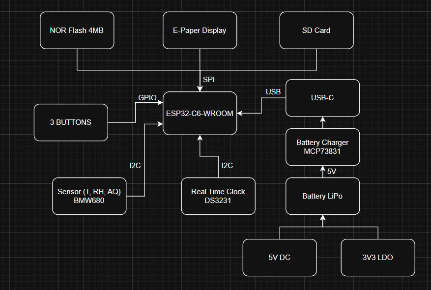

# OpenBook E-Book Reader
Made by: Vintilescu Andrei-Florin, 332CA

University: UNSTPB, Bucharest

## Conținutul Repository-ului

OpenBook

    Hardware

        OpenBook.sch            // Fișierul schematic

        OpenBook.brd            // Fișierul PCB

    Manufacturing

        gerbers.zip             // Pachetul Gerber generat

        OpenBook.bom            // Bill Of Materials (BOM)

        OpenBook.cpl            // Fișier Pick and Place

    Mechanical

        OpenBook_exploded.step  // Model 3D exploded view (PCB + baterie + display + carcasă)

        OpenBook_Fusion360.f3d  // Fișierul 3D nativ Fusion360

    Images

        pcb_render.png          // Imagine cu randări ale PCB-ului

        device_render.png       // Randări ale dispozitivului complet

    LICENSE                     // Licența open source (ex. Apache 2.0)

    README.md                   // Acest fișier

## Diagramă Bloc a Sistemului

## Bill Of Materials (BOM)

| Device                                                                                  | DATASHEET                                                                                                     | PURCHASE-URL                                                                                                                            |
|-----------------------------------------------------------------------------------------|---------------------------------------------------------------------------------------------------------------|-----------------------------------------------------------------------------------------------------------------------------------------|
| ADAFRUIT_LEDCHIP-LED0603                                                                | https://www.snapeda.com/parts/KP-1608SURCK/Kingbright/datasheet/                                              | https://www.snapeda.com/parts/KP-1608SURCK/Kingbright/view-part/?ref=search&t=LED%200603                                                  |
| ESP32_WROVER_EAGLE-LTSPICE_RR0402                                                       | https://analytics.supplyframe.com/trackingservlet/track/?r=0x34... (link lung)                                | https://componentsearchengine.com/part-view/R0402%201%25%20100%20K%20(RC0402FR-07100KL)/YAGEO                                          |
| SJ                                                                                      | https://grabcad.com/library/solder-jumpers-1                                                                  | https://grabcad.com/library/solder-jumpers-1                                                                                            |
| EAGLE-LTSPICE_CC0402                                                                    | https://analytics.supplyframe.com/trackingservlet/track/?r=0x34... (link lung)                                | https://componentsearchengine.com/part-view/CC0402MRX5R5BB106/YAGEO                                                                    |
| ESP32_WROVER_EAGLE-LTSPICE_RR0402                                                       | https://analytics.supplyframe.com/trackingservlet/track/?r=0x34... (link lung)                                | https://componentsearchengine.com/part-view/R0402%201%25%20100%20K%20(RC0402FR-07100KL)/YAGEO                                          |
| ESP32_WROVER_EAGLE-LTSPICE_RR0402                                                       | https://analytics.supplyframe.com/trackingservlet/track/?r=0x34... (link lung)                                | https://componentsearchengine.com/part-view/R0402%201%25%20100%20K%20(RC0402FR-07100KL)/YAGEO                                          |
| EAGLE-LTSPICE_CC0402                                                                    | https://analytics.supplyframe.com/trackingservlet/track/?r=0x34... (link lung)                                | https://componentsearchengine.com/part-view/CC0402MRX5R5BB106/YAGEO                                                                    |
| RCL_CPOL-EUCT3528                                                                       | https://s3.amazonaws.com/snapeda/datasheet/TAJB475K025RNJ_AVX.pdf                                             | https://www.snapeda.com/parts/TAJB475K025RNJ/AVX/view-part/?ref=dk&t=capacitor%203528&con_ref=None                                     |
| ESP32_WROVER_EAGLE-LTSPICE_RR0402                                                       | https://analytics.supplyframe.com/trackingservlet/track/?r=0x34... (link lung)                                | https://componentsearchengine.com/part-view/R0402%201%25%20100%20K%20(RC0402FR-07100KL)/YAGEO                                          |
| ESP32_WROVER_EAGLE-LTSPICE_RR0402                                                       | https://analytics.supplyframe.com/trackingservlet/track/?r=0x34... (link lung)                                | https://componentsearchengine.com/part-view/R0402%201%25%20100%20K%20(RC0402FR-07100KL)/YAGEO                                          |
| EAGLE-LTSPICE_CC0402                                                                    | https://analytics.supplyframe.com/trackingservlet/track/?r=0x34... (link lung)                                | https://componentsearchengine.com/part-view/CC0402MRX5R5BB106/YAGEO                                                                    |
| 112A-TAAR-R03_ATTEND                                                                    | https://store.comet.srl.ro/Catalogue/Product/43497/                                                           | https://store.comet.srl.ro/Catalogue/Product/43497/                                                                                     |
| ESP32_WROVER_EAGLE-LTSPICE_RR0402                                                       | https://analytics.supplyframe.com/trackingservlet/track/?r=0x34... (link lung)                                | https://componentsearchengine.com/part-view/R0402%201%25%20100%20K%20(RC0402FR-07100KL)/YAGEO                                          |
| EAGLE-LTSPICE_CC0402                                                                    | https://analytics.supplyframe.com/trackingservlet/track/?r=0x34... (link lung)                                | https://componentsearchengine.com/part-view/CC0402MRX5R5BB106/YAGEO                                                                    |
| EAGLE-LTSPICE_CC0402                                                                    | https://analytics.supplyframe.com/trackingservlet/track/?r=0x34... (link lung)                                | https://componentsearchengine.com/part-view/CC0402MRX5R5BB106/YAGEO                                                                    |
| ESP32_WROVER_EAGLE-LTSPICE_RR0402                                                       | https://analytics.supplyframe.com/trackingservlet/track/?r=0x34... (link lung)                                | https://componentsearchengine.com/part-view/R0402%201%25%20100%20K%20(RC0402FR-07100KL)/YAGEO                                          |
| ESP32_WROVER_EAGLE-LTSPICE_RR0402                                                       | https://analytics.supplyframe.com/trackingservlet/track/?r=0x34... (link lung)                                | https://componentsearchengine.com/part-view/R0402%201%25%20100%20K%20(RC0402FR-07100KL)/YAGEO                                          |
| ESP32_WROVER_SPARKFUN-DISCRETESEMI_MOSFET_PCH-DMG2305UX-7                               | https://analytics.supplyframe.com/trackingservlet/track/?r=0x34... (link lung)                                | https://componentsearchengine.com/part-view/DMG2305UX-7/Diodes%20Incorporated                                                         |
| ESP32_WROVER_EAGLE-LTSPICE_RR0402                                                       | https://analytics.supplyframe.com/trackingservlet/track/?r=0x34... (link lung)                                | https://componentsearchengine.com/part-view/R0402%201%25%20100%20K%20(RC0402FR-07100KL)/YAGEO                                          |
| EAGLE-LTSPICE_CC0402                                                                    | https://analytics.supplyframe.com/trackingservlet/track/?r=0x34... (link lung)                                | https://componentsearchengine.com/part-view/CC0402MRX5R5BB106/YAGEO                                                                    |
| EAGLE-LTSPICE_CC0402                                                                    | https://analytics.supplyframe.com/trackingservlet/track/?r=0x34... (link lung)                                | https://componentsearchengine.com/part-view/CC0402MRX5R5BB106/YAGEO                                                                    |
| ESP32_WROVER_EAGLE-LTSPICE_RR0402                                                       | https://analytics.supplyframe.com/trackingservlet/track/?r=0x34... (link lung)                                | https://componentsearchengine.com/part-view/R0402%201%25%20100%20K%20(RC0402FR-07100KL)/YAGEO                                          |
| 744043680IND_4828-WE-TPC_WRE                                                             | https://www.we-online.com/components/products/datasheet/744043680.pdf                                        | https://eu.mouser.com/ProductDetail/Wurth-Elektronik/744043680?qs=PGXP4M47uW6VkZq%252BkzjrHA%3D%3D                                      |
| BD5229G-TR                                                                              | https://analytics.supplyframe.com/trackingservlet/track/?r=0x34... (link lung)                                | https://componentsearchengine.com/part-view/XC6220A331MR-G/Torex                                                                       |
| ESP32_WROVER_BME680_BME680                                                              | https://www.snapeda.com/parts/BME680/Bosch%20Sensortec/datasheet/                                             | https://www.google.com/url?q=https://www.snapeda.com/parts/BME680/Bosch/view-part/?welcome%3Dhome&sa=D&source=editors&ust=...&usg=... |
| BUTTON_CUSYOMV1                                                                         | https://industry.panasonic.com/global/en/downloads?tab=catalog&small_g_cd=203&part_no=EVQPUJ02K             | https://industry.panasonic.com/global/en/products/control/switch/light-touch/number/evqpuj02k                                           |
| CPH3225A                                                                                | https://www.snapeda.com/parts/CPH3225A/Seiko%20Instruments/datasheet/                                         | https://www.snapeda.com/parts/CPH3225A/Seiko+Instruments/view-part/?ref=eda                                                             |
| DS3231SN#                                                                               | https://www.snapeda.com/parts/DS3231SN%23/Analog%20Devices/datasheet/                                         | https://www.snapeda.com/parts/DS3231SN%23/Analog+Devices/view-part/?ref=eda                                                             |
| ESP32-C6-WROOM-1-N8                                                                     | https://www.snapeda.com/parts/ESP32-C6-WROOM-1-N8/Espressif%20Systems/datasheet/                              | https://www.snapeda.com/parts/ESP32-C6-WROOM-1-N8/Espressif+Systems/view-part/?ref=eda                                                  |
| ESP32C6_VARISTORCN1812                                                                  | https://www.snapeda.com/parts/MOV-10D561K/Bourns/datasheet/                                                   | https://www.snapeda.com/parts/MOV-10D561K/Bourns/view-part/?welcome=home&ref=search&t=varistor                                           |
| ESP32_WROVER_AVX---SD0805S020S1R0_AVX_SD0805S020S1R0_0_0AVX_SD0805S020S1R0_0_0          | https://ro.mouser.com/datasheet/2/40/schottky-3165252.pdf                                                     | https://ro.mouser.com/ProductDetail/KYOCERA-AVX/SD0805S020S1R0?qs=jCA%252BPfw4LHbpkAoSnwrdjw%3D%3D                                      |
| ESP32_WROVER_SPARKFUN-IC-POWER_MCP73831                                                 | https://eu.mouser.com/datasheet/2/268/MCP73831_Family_Data_Sheet_DS20001984H-3441711.pdf                      | https://eu.mouser.com/ProductDetail/Microchip-Technology/MCP73831T-2ACI-OT?qs=yUQqVecv4qvbBQBGbHx0Mw%3D%3D                              |
| FH34SRJ-24S-0.5SH_99_                                                                   | https://analytics.supplyframe.com/trackingservlet/track/?r=0x34... (link lung)                                | https://componentsearchengine.com/part-view/FH34SRJ-24S-0.5SH(99)/Hirose                                                               |
| MAX17048G+T10                                                                           | https://www.snapeda.com/parts/MAX17048G+T10/Analog%20Devices/datasheet/                                       | https://www.snapeda.com/parts/MAX17048G+T10/Analog+Devices/view-part/?ref=eda                                                           |
| MBR0530                                                                                 | https://www.snapeda.com/parts/MBR0530/ON%20Semiconductor/datasheet/                                           | https://www.snapeda.com/parts/MBR0530/Onsemi/view-part/?ref=eda                                                                         |
| PGB1010603MR                                                                            | https://www.snapeda.com/parts/PGB1010603MR/Littelfuse%20Inc./datasheet/                                       | https://www.snapeda.com/parts/PGB1010603MR/Littelfuse/view-part/?ref=eda                                                                |
| QWIIC_RIGHT_ANGLE                                                                       | https://eu.mouser.com/ProductDetail/Adafruit/4208?qs=PzGy0jfpSMtbScLbr0L5dw%3D%3D                           | https://eu.mouser.com/ProductDetail/Adafruit/4208?qs=PzGy0jfpSMtbScLbr0L5dw%3D%3D                                                     |
| SAMACSYS_PARTS_USB4110-GF-A                                                             | https://analytics.supplyframe.com/trackingservlet/track/?r=0x34... (link lung)                                | https://componentsearchengine.com/part-view/USB4110-GF-A/GCT%20(GLOBAL%20CONNECTOR%20TECHNOLOGY)                                        |
| ESP32_WROVER_AVX---SD0805S020S1R0_AVX_SD0805S020S1R0_0_0AVX_SD0805S020S1R0_0_0          | https://ro.mouser.com/datasheet/2/40/schottky-3165252.pdf                                                     | https://ro.mouser.com/ProductDetail/KYOCERA-AVX/SD0805S020S1R0?qs=jCA%252BPfw4LHbpkAoSnwrdjw%3D%3D                                      |
| SI1308EDL-T1-GE3                                                                        | https://www.snapeda.com/parts/SI1308EDL-T1-GE3/Vishay%20Siliconix/datasheet/                                   | https://www.snapeda.com/parts/SI1308EDL-T1-GE3/Vishay+Siliconix/view-part/?ref=eda                                                      |
| TPTP20R                                                                                 | self made                                                                                                     | self made                                                                                                                               |
| USBLC6-2SC6Y                                                                            | https://www.snapeda.com/parts/USBLC6-2SC6Y/STMicroelectronics/datasheet/                                      | https://www.snapeda.com/parts/USBLC6-2SC6Y/STMicroelectronics/view-part/?ref=eda                                                        |
| W25Q512JVEIQ                                                                            | https://www.snapeda.com/parts/W25Q512JVEIQ/Winbond%20Electronics/datasheet/                                   | https://www.snapeda.com/parts/W25Q512JVEIQ/Winbond+Electronics/view-part/?ref=eda                                                       |
| XC6220A331MR-G                                                                          | https://analytics.supplyframe.com/trackingservlet/track/?r=0x34... (link lung)                                |                                                                                                                                         |

*Notă:* De asemenea lista completa de componente cu linkurile complete pentru datasheet si purchase-url o gasiti consultand fișierul `BOM.csv` inclus în directorul Manufacturing.

---

## Funcționalitatea Hardware în Detaliu

Acest proiect integrează următoarele module și componente:

- **ESP32-C6 Microcontroller:**  
  - Rol: Procesare centrală și interfațare cu toate componentele.  
  - Interfețe:  
    - UART pentru comunicare cu modulul e-Paper  
    - SPI pentru senzorii periferici  
    - I2C pentru conectarea accelerometrului și a altor senzori  
  - Specificații: Calcul estimativ de consum energetic, rutare optimizată a pinilor și implementare a planurilor de masă pe ambele straturi (TOP și BOTTOM) pentru stabilitate electrică.

- **Display e-Paper:**  
  - Rol: Afișare de text și imagini cu consum redus de energie.  
  - Interfață: SPI, cu un set dedicat de pini conectați direct la ESP32-C6.
  
- **Baterie LiPo:**  
  - Rol: Alimentarea dispozitivului.  
  - Observații: Bateria este conectată direct la patru test pad-uri conform specificațiilor pentru economisirea spațiului.  
 
- **Decuplaje și Protecții:**  
  - Utilizare condensatoare 100 nF amplasate cât mai aproape de pinii de alimentare pentru a asigura o decuplare corespunzătoare.  
  - Rutare a traseelor de putere la 0.3mm, iar semnalele de date la cel puțin 0.15mm conform specificațiilor.

- **Plan de Masă și Rutare:**  
  - Implementare a unui plan de masă atât pe layer-ul TOP cât și pe BOTTOM.  
  - Vias-urile au fost plasate strategic și folosim tehnici de Via Stitching, în special în zona modulului ESP32, pentru a minimiza interferențele.

- **Constrângeri Mecanice:**  
  - PCB-ul de 1mm grosime este proiectat să se încadreze perfect în carcasa specificată.  
  - Toate componentele principale sunt grupate în jurul microcontroller-ului și amplasate exclusiv pe layer-ul TOP de conformitate cu cerințele proiectului.

---

## Configurarea și Utilizarea Pinii ESP32-C6

Mai jos este un sumar al pinilor utilizați și a motivelor alese:

| Pin ESP32-C6 | Funcționalitate Asociată         | Motiv/Observații                              |
|--------------|----------------------------------|-----------------------------------------------|
| GPIO12       | SPI_MISO pentru Display e-Paper  | Necesită viteză mare și stabilitate la semnal  |
| GPIO13       | SPI_MOSI pentru Display e-Paper  | Pentru comunicații rapide și fiabile           |
| GPIO14       | SPI_CLK pentru Display e-Paper   | Sincronizare precisă a semnalului              |
| GPIO15       | CS (Chip Select) pentru e-Paper  | Control dedicated pentru selecție modul         |
| GPIO2        | I2C SDA pentru Senzori           | Interfață I2C standard pentru accelerometru/senzori |
| GPIO4        | I2C SCL pentru Senzori           | Necesită semnal clar pentru sincronizarea I2C  |
| ...          | Alte pini alocați conform necesităților proiectului | Consultare schema detaliată pentru alocare        |

## Concluzie

  Proiectul OpenBook a urmarit dezvoltarea unui dispozitiv e-book reader accesibil, open-source, cu un design hardware optimizat pentru productie de masa. Am parcurs toate etapele de validare, de la schema electrica si PCB pana la integrarea mecanica completa in carcasa finala. Design-ul respecta constrangerile functionale, mecanice si de buna practica, fiind pregatit pentru testare si productie. Documentatia completa si fisierele necesare sunt disponibile in acest repository.

---

