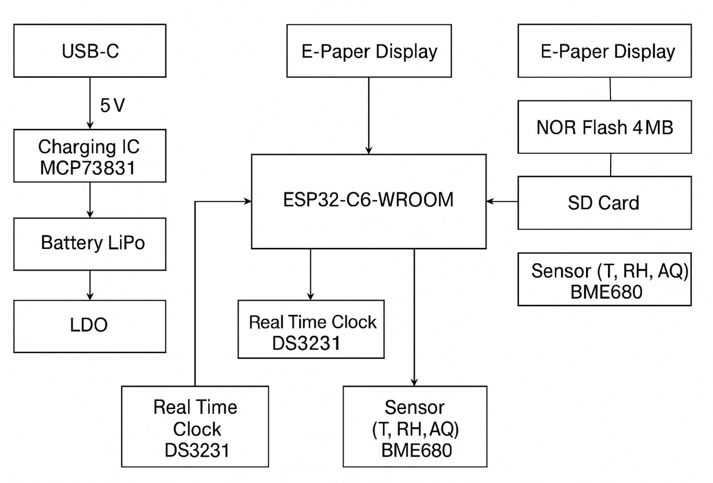

# OpenBook E-Book Reader
Made by: Vintilescu Andrei-Florin, 332CA

University: UNSTPB, Bucharest

## Conținutul Repository-ului

OpenBook

    Hardware

        OpenBook.sch            // Fișierul schematic

        OpenBook.brd            // Fișierul PCB

    Manufacturing

        gerbers.zip             // Pachetul Gerber generat

        OpenBook.bom            // Bill Of Materials (BOM)

        OpenBook.cpl            // Fișier Pick and Place

    Mechanical

        OpenBook_exploded.step  // Model 3D exploded view (PCB + baterie + display + carcasă)

        OpenBook_Fusion360.f3d  // Fișierul 3D nativ Fusion360

    Images

        pcb_render.png          // Imagine cu randări ale PCB-ului

        device_render.png       // Randări ale dispozitivului complet

    LICENSE                     // Licența open source (ex. Apache 2.0)

    README.md                   // Acest fișier

## Diagramă Bloc a Sistemului

## Bill Of Materials (BOM)

*Notă:* Pentru lista completă de componente, consultați fișierul `BOM.csv` inclus în directorul Manufacturing.

---

## Funcționalitatea Hardware în Detaliu

Acest proiect integrează următoarele module și componente:

- **ESP32-C6 Microcontroller:**  
  - Rol: Procesare centrală și interfațare cu toate componentele.  
  - Interfețe:  
    - UART pentru comunicare cu modulul e-Paper  
    - SPI pentru senzorii periferici  
    - I2C pentru conectarea accelerometrului și a altor senzori  
  - Specificații: Calcul estimativ de consum energetic, rutare optimizată a pinilor și implementare a planurilor de masă pe ambele straturi (TOP și BOTTOM) pentru stabilitate electrică.

- **Display e-Paper:**  
  - Rol: Afișare de text și imagini cu consum redus de energie.  
  - Interfață: SPI, cu un set dedicat de pini conectați direct la ESP32-C6.
  
- **Baterie LiPo:**  
  - Rol: Alimentarea dispozitivului.  
  - Observații: Bateria este conectată direct la patru test pad-uri conform specificațiilor pentru economisirea spațiului.  
 
- **Decuplaje și Protecții:**  
  - Utilizare condensatoare 100 nF amplasate cât mai aproape de pinii de alimentare pentru a asigura o decuplare corespunzătoare.  
  - Rutare a traseelor de putere la 0.3mm, iar semnalele de date la cel puțin 0.15mm conform specificațiilor.

- **Plan de Masă și Rutare:**  
  - Implementare a unui plan de masă atât pe layer-ul TOP cât și pe BOTTOM.  
  - Vias-urile au fost plasate strategic și folosim tehnici de Via Stitching, în special în zona modulului ESP32, pentru a minimiza interferențele.

- **Constrângeri Mecanice:**  
  - PCB-ul de 1mm grosime este proiectat să se încadreze perfect în carcasa specificată.  
  - Toate componentele principale sunt grupate în jurul microcontroller-ului și amplasate exclusiv pe layer-ul TOP de conformitate cu cerințele proiectului.

---

## Configurarea și Utilizarea Pinii ESP32-C6

Mai jos este un sumar al pinilor utilizați și a motivelor alese:

| Pin ESP32-C6 | Funcționalitate Asociată         | Motiv/Observații                              |
|--------------|----------------------------------|-----------------------------------------------|
| GPIO12       | SPI_MISO pentru Display e-Paper  | Necesită viteză mare și stabilitate la semnal  |
| GPIO13       | SPI_MOSI pentru Display e-Paper  | Pentru comunicații rapide și fiabile           |
| GPIO14       | SPI_CLK pentru Display e-Paper   | Sincronizare precisă a semnalului              |
| GPIO15       | CS (Chip Select) pentru e-Paper  | Control dedicated pentru selecție modul         |
| GPIO2        | I2C SDA pentru Senzori           | Interfață I2C standard pentru accelerometru/senzori |
| GPIO4        | I2C SCL pentru Senzori           | Necesită semnal clar pentru sincronizarea I2C  |
| ...          | Alte pini alocați conform necesităților proiectului | Consultare schema detaliată pentru alocare        |

## Informații Suplimentare

  404

---

